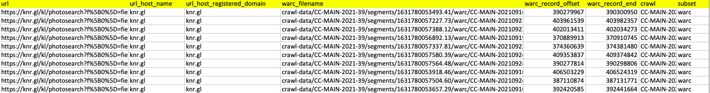

# CommonCrawl Downloader

**Purpose**
[CommonCrawl](https://commoncrawl.org/the-data/get-started/) is a nonprofit organization that crawls the web and freely provides its archives and datasets to the public. The Common Crawl corpus contains petabytes of data collected since 2013. It contains monthly updates of raw web page data, extracted metadata and text extractions that are hosted on Amazon Web Services' (AWS) S3 storage servers located in the US-East-1 (Northern Virginia) AWS Region.

This script was written with the purpose of downloading and processing the raw web page data for a user-provided list of domain names (e.g. apple.com, walmart.com, microsoft.com). The raw html of a webpage is downloaded and parsed into clear text. Then all passages around mentions of a user-provided list of keywords are extracted.

All input files should be csv. 

Fargate spot cheap, transfer speed maximal because we access the CommonCrawl data from the same region where it is hosted.

## **athena_lookup.py**: 

This file takes a list of website addresses as its input and crawls the urls for the selected timeframe from common crawl. Then it outputs the address of subpages that contain specific keywords and the n shortest urls for each website address, where the specific keywords and n are determined by user.   

*Input example:* \

*Warning:* urls should not contain "https" or "www." upfront.

**Parameters**  
* n_subpages: number of shortest subpages that are selected for each website address in the output table. 
* url_keywords: list of keywords that if any of them exists in a url address, that url is selected in the output table. 
* crawl: this parameter determines the desired timeframe. CRAWL-NAME-YYYY-WW – The name of the crawl and year + week it was initiated. (... OR crawl = 'CC-MAIN-2020-24' OR crawl = 'CC-MAIN-2020-50')
 

**Code explanation**

The main function that is executed in the Athena_lookup class is the run_lookup function. This function calls some other important functions. The description for the tasks of each function is as following: 
* drop_all_tables: This function clears previous results if there exists any. 
* create_url_list_table: This function creates a new table from the input file, with columns "websiteaddress" and "bvdidnumber".
* create_ccindex_table: This function creates a large table by selecting some columns from the original common crawl database.
* repair_ccindex_table: This function is used to make Athena recognize the data partitions on S3. 
* inner_join: This function merges the two tables created through create_ccindex_table and create_url_list_table functions on the url. The resulting table contains the address of all the historical subpages of the urls in the input file, for the selected timeframe.   
* select_subpages: The merged table created through the inner_join function is very large. Therefore, we only select the subpages that contain a specific keyword in their website address, and the n_subpages shortest urls. n_subpages is an integer number and is one of the parameters that is determined by the user. For example, if "covid" is in the url_keywords list, the following url will be selected because it contains one of the keywords:'siemens.de/covid-19'. 

*Output example:*\

